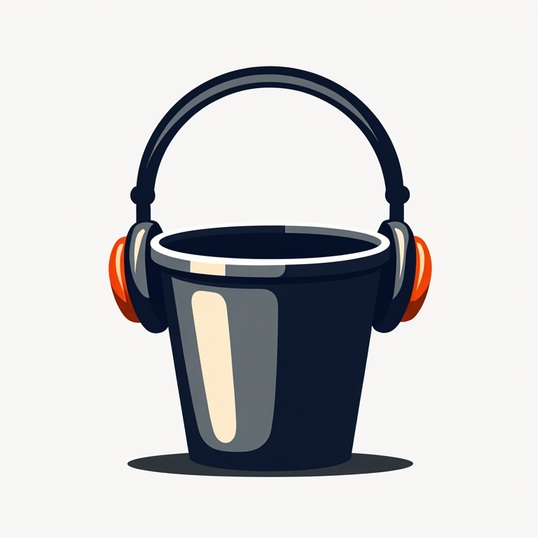

# ListenBucket

[](https://github.com/chrisg32/ListenBucket/actions/workflows/ci.yml)
[](https://github.com/chrisg32/ListenBucket/actions/workflows/release.yml)
[](https://goreportcard.com/report/github.com/chrisg32/ListenBucket)
[](https://opensource.org/licenses/Apache-2.0)


**Create podcast feeds from any video source.** A personal format-shifting tool for audio content. ListenBucket extracts audio from online videos and creates personal podcast feeds, allowing you to listen to content in your preferred podcast app.

<p align="center">
  
</p>

## Disclaimer

This tool is provided for personal, lawful use only. We do not condone or support copyright infringement. Users are responsible for ensuring their use complies with applicable laws and terms of service. Please support the platforms and content creators you enjoy.

## Features

- **Format Shifting** - Convert online videos to audio for personal listening
- **Automatic Updates** - Playlists and channels are checked hourly for new content
- **Podcast Compatible** - Subscribe in Apple Podcasts, Overcast, Pocket Casts, or any podcast app
- **Self-Hosted** - Your data stays on your server
- **Single Binary** - Easy deployment with Docker or standalone
- **Dark Mode** - Light and dark themes
- **Mobile Friendly** - Responsive design works on any device

## Quick Start

### Docker (Recommended)

```bash
docker run -d \
  --name listenbucket \
  -p 8080:8080 \
  -v listenbucket_data:/data \
  theonecalledchris/listenbucket:latest
```

> **Note:** The `-p 8080:8080` flag is required to access the web interface. Without it, the container's port won't be accessible from your host.

Or with Docker Compose:

```bash
curl -O https://raw.githubusercontent.com/chrisg32/ListenBucket/main/docker-compose.yml
docker-compose up -d
```

Access the app at **http://localhost:8080**

### CasaOS

1. Open the CasaOS web interface
2. Click the **+** button to add a new app
3. Select **Install a customized app**
4. Choose **Import** and select `docker-compose`
5. Paste the contents of [`docker-compose.casaos.yml`](docker-compose.casaos.yml)
6. **Important:** Edit `BASE_URL` to match your CasaOS server's IP address
7. Click **Submit**

Data is stored in `/DATA/AppData/listenbucket/`.

## Configuration

| Variable | Default | Description |
|----------|---------|-------------|
| `PORT` | `8080` | HTTP server port |
| `DATA_DIR` | `/data` | Database and media storage |
| `BASE_URL` | `http://localhost:8080` | Public URL for RSS feeds |

## Usage

1. **Create a Feed** - Or use the default "Listen Later" feed
2. **Add Sources** - Paste video, playlist, or channel URLs
3. **Subscribe** - Copy the RSS link or open directly in your podcast app
4. **Listen** - Episodes download automatically as MP3s

## Development

### Prerequisites

- Go 1.22+
- Node.js 20+
- yt-dlp
- ffmpeg

### Setup

```bash
# Clone the repository
git clone https://github.com/chrisg32/ListenBucket.git
cd ListenBucket

# Install dependencies
make deps

# Run in development mode
make dev
```

### Build

```bash
# Build everything
make build

# Run tests
make test

# Build Docker image
docker build -t listenbucket .
```

## API

ListenBucket provides a RESTful API for automation and integration.

### Endpoints

| Method | Endpoint | Description |
|--------|----------|-------------|
| `GET` | `/api/feeds` | List all feeds |
| `POST` | `/api/feeds` | Create a feed |
| `GET` | `/api/feeds/{id}/rss` | Get RSS feed |
| `POST` | `/api/feeds/{id}/sources` | Add a source |
| `GET` | `/api/episodes` | List all episodes |

See the full [API documentation](#api-reference) below.

<details>
<summary><strong>API Reference</strong></summary>

### Feeds

```bash
# List feeds
curl http://localhost:8080/api/feeds

# Create feed
curl -X POST http://localhost:8080/api/feeds \
  -H "Content-Type: application/json" \
  -d '{"title":"My Feed"}'

# Get RSS
curl http://localhost:8080/api/feeds/{feedId}/rss
```

### Sources

```bash
# Add a video
curl -X POST http://localhost:8080/api/feeds/{feedId}/sources \
  -H "Content-Type: application/json" \
  -d '{"url":"https://..."}'

# Add playlist (new videos only)
curl -X POST http://localhost:8080/api/feeds/{feedId}/sources \
  -H "Content-Type: application/json" \
  -d '{"url":"https://...","include_back_catalog":false}'
```

### Episodes

```bash
# List episodes
curl http://localhost:8080/api/feeds/{feedId}/episodes

# Retry failed download
curl -X POST http://localhost:8080/api/episodes/{episodeId}/retry

# Delete episode
curl -X DELETE http://localhost:8080/api/episodes/{episodeId}
```

### Error Responses

```json
{
  "error": "not_found",
  "message": "feed not found",
  "code": 404
}
```

</details>

## Architecture

ListenBucket uses a single-binary architecture with:
- **Backend**: Go with Chi router and SQLite
- **Frontend**: Vue.js 3 with Tailwind CSS (embedded in binary)
- **Media**: yt-dlp for downloading, ffmpeg for audio extraction

See [ARCHITECTURE.md](ARCHITECTURE.md) for detailed technical documentation.

## Contributing

Contributions are welcome! Please feel free to submit a Pull Request.

1. Fork the repository
2. Create your feature branch (`git checkout -b feature/amazing-feature`)
3. Commit your changes (`git commit -m 'Add amazing feature'`)
4. Push to the branch (`git push origin feature/amazing-feature`)
5. Open a Pull Request

## License

This project is licensed under the Apache License 2.0 - see the [LICENSE](LICENSE) file for details.

## Acknowledgments

- Architecture inspired by [Mailpit](https://mailpit.axllent.org/)
- Powered by [yt-dlp](https://github.com/yt-dlp/yt-dlp)
